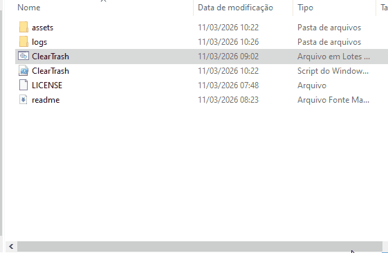

# ClearTrash

<p align="center">


</p>

ClearTrash is a small Windows CLI cleanup tool written in **PowerShell**, with a **Batch launcher**.

I mainly created this project so people could study it.
The code is very straightforward, which makes it easier to understand how everything works.

The idea is simple: choose folders, pick how files should be deleted, and let the script handle the rest.

---

## Demo

<p align="center">

</p>

---

## Features

- interactive CLI menu
- choose folders to clean
- multiple deletion modes
- progress bar during cleanup
- pause / resume with keyboard input
- optional logging system
- configurable behavior using `ClearTrash.config.json`
- preview before cleanup
- retry mechanism for failed deletions
- shows how much disk space was freed

ClearTrash also includes a **configuration file** that allows adjusting internal behavior without modifying the script.

Example settings that can be configured:

- default log directory
- retry attempts for failed deletions
- retry delay
- confirmation prompts
- JSON log generation
- limits for preview and detailed log entries

---

## Cleaning modes

The tool currently supports different deletion strategies.

**Recycle Bin**

Files are moved to the Windows Recycle Bin.

**Permanent delete**

Files are removed directly from disk.

**Recycle + empty**

Files go to the Recycle Bin and the bin is emptied afterwards.

---

## Logging

ClearTrash can generate cleanup logs.

Logs may include:

- cleanup summary
- disk space freed
- failed deletions
- detailed list of removed files

The logging system can generate **standard logs and JSON logs**, depending on the configuration.

When logging is enabled, the script offers two options:

**Default**

The script automatically creates a `logs` folder in the same directory as the script and stores the log files there.

Example:

```
ClearTrash
│
├ ClearTrash.ps1
├ ClearTrash.bat
├ ClearTrash.config.json
├ logs
│ └ ClearTrash_2026-03-11_10-04-07.log
└ README.md
```

**Custom path**

The user can choose any folder to store the logs.

Example:

```
C:\Users\YourName\Documents\ClearTrashLogs
```

If logging is disabled, the cleanup runs normally and no log file is generated.

---

## Configuration

ClearTrash includes a configuration file:

`ClearTrash.config.json`

This file allows modifying some internal behavior of the tool without changing the script.

Examples of configurable options:

- default log directory
- retry attempts
- retry delay
- confirmation prompts
- preview limits
- enabling JSON logs

---

## Running the tool

Clone the repository:

```
git clone https://github.com/MrcVnz/ClearTrash.git
```

Enter the folder:

```
cd ClearTrash
```

Run the launcher in powershell:

```
.\ClearTrash.bat
```

Run the launcher in CMD:

```
ClearTrash.bat
```

The batch file simply launches the PowerShell script with the correct permissions.

---

### Why a `.bat` launcher?

The project includes a small `.bat` launcher to make the script easier to run.

It avoids common PowerShell execution policy issues and allows users to start the tool with a simple command or double-click, without needing to manually run the PowerShell script.

---

## Download

<p align="center">
<a href="https://github.com/MrcVnz/ClearTrash/releases/download/v1.2.0/ClearTrash-v1.2.0.zip">

</a>
<a href="https://github.com/MrcVnz/ClearTrash/archive/refs/tags/v1.0.0.zip">

</a>
<a href="https://github.com/MrcVnz/ClearTrash/releases/download/v1.1.0/ClearTrash-v1.1.0.zip">

</a>
</p>

---

## Project structure

```
ClearTrash
│
├ ClearTrash.ps1
├ ClearTrash.bat
├ ClearTrash.config.json
├ logs
└ README.md
```

**ClearTrash.ps1**

Main script responsible for:

- CLI interface
- folder scanning
- deletion logic
- progress bar
- logging
- configuration loading

**ClearTrash.bat**

Simple launcher that starts the PowerShell script.

**ClearTrash.config.json**

Configuration file used to control some internal behavior of the tool.

---

## Why I built this project

I wanted to build a simple tool that could help people who are learning these languages.

It’s not exactly an easy thing for a beginner to create, but working on something like this helps you understand how the system behaves and how different parts of the machine interact.

Instead of writing small isolated scripts, I tried to build something that feels closer to a real utility.

---


## Version

Current version: **1.2.0**

---

## License

MIT